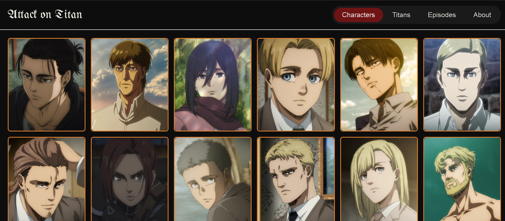

# Attack on Titan Site

A learning project built with **Vanilla TypeScript + Vite** to explore frontend fundamentals: DOM manipulation, async data fetching, TypeScript typing, and CSS layout techniques — no frameworks involved.

Browse characters, titans, and episodes from the Attack on Titan anime, with a dark, gothic-inspired UI.

## Features

- **Characters** — flip cards showing key characters, with image, status, occupation, and residence
- **Titans** — flip cards with height and abilities for each Titan
- **Episodes** — IMDB-style episode list, grouped and filterable by season
- **Custom UI** — dark theme, glowing card borders, flip-on-click cards, sticky navbar
- **Client-side view switching** — no page reloads between sections

## Tech Stack

- [Vite](https://vitejs.dev/) — dev server & build tool
- TypeScript (strict mode, no framework)
- Plain HTML/CSS
- [Attack on Titan API](https://www.attackontitanapi.com) — free, no API key required

## Project Structure

```
src/
├── main.ts                     # Entry point, view switching logic
├── types/                      # TypeScript interfaces per data model
├── api/                        # Fetch functions per resource (characters, titans, episodes)
├── components/                 # Card builders (DOM element factories)
├── assets/                     # Custom images
└── style.css                   # All styling, CSS variables for theming
```

## Getting Started

```bash
npm install
npm run dev
```

Then open the local URL shown in the terminal (usually `http://localhost:5173`).

## Build for Production

```bash
npm run build
```

Outputs a production-ready `dist/` folder.

## Data Source

All character, titan, and episode data is fetched live from the free
[Attack on Titan API](https://www.attackontitanapi.com), a community-maintained resource.

## Disclaimer

This is a **non-commercial, fan-made educational project**. All characters, images,
names, and story elements related to Attack on Titan are the property of
**Hajime Isayama** and **Kodansha** (original manga), and **Wit Studio / MAPPA**
(anime adaptation). No copyright infringement is intended, and no revenue is
generated from this project.

The source code in this repository is licensed under the MIT License (see [LICENSE](./LICENSE)).
This license covers the code only — not the Attack on Titan characters, artwork, or story content.
